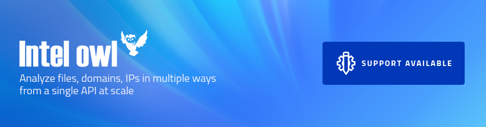

 
_For urgent issues and priority support, visit [https://xscode.com/intelowlproject/IntelOwl](https://xscode.com/intelowlproject/IntelOwl)._

# Intel Owl

Do you want to get **threat intelligence data** about a malware, an IP or a domain? Do you want to get this kind of data from multiple sources at the same time using **a single API request**?

You are in the right place!

Intel Owl is an Open Source Intelligence, or OSINT solution to get threat intelligence data about a specific file, an IP or a domain from a single API at scale. It integrates a number of analyzers available online and is for everyone who needs a single point to query for info about a specific file or observable.

### Features

- Provides enrichment of threat intel for malware as well as observables (IP, Domain, URL and hash).
- This application is built to **scale out** and to **speed up the retrieval of threat info**.
- It can be integrated easily in your stack of security tools ([pyintelowl](https://github.com/intelowlproject/pyintelowl)) to automate common jobs usually performed, for instance, by SOC analysts manually.
- Intel Owl is composed of **analyzers** that can be run to retrieve data from external sources (like VirusTotal or AbuseIPDB) or to generate intel from internal analyzers (like Yara or Oletools)
- API written in Django and Python 3.7.
- Inbuilt frontend client: **[IntelOwl-ng](https://github.com/intelowlproject/IntelOwl-ng)** provides features such as dashboard, visualizations of analysis data, easy to use forms for requesting new analysis, etc. [Live Demo](https://intelowlclient.firebaseapp.com/).

## Documentation

Documentation about IntelOwl installation, usage, configuration and contribution can be found at https://intelowl.readthedocs.io/.

## Blog posts

To know more about the project and it's growth over time, you may be interested in reading the following:

- [Intel Owl on Daily Swig](https://portswigger.net/daily-swig/intel-owl-osint-tool-automates-the-intel-gathering-process-using-a-single-api)
- [Honeynet: v1.0.0 Announcement](https://www.honeynet.org/?p=7558)
- [Certego Blog: First announcement](https://www.certego.net/en/news/new-year-new-tool-intel-owl/)

## Available services or analyzers

You can see the full list of all available analyzers in the [documentation](https://intelowl.readthedocs.io/en/latest/Usage.html#available-analyzers) or [live demo](https://intelowlclient.firebaseapp.com/pages/analyzers/table).

| Inbuilt modules 	| External Services 	| Free modules that require additional configuration 	|
|-	|-	|-	|
| - Static Document, RTF, PDF, PE, Generic File Analysis - Strings analysis with ML - PE Emulation with Speakeasy - PE Signature verification - PE Capabilities Extraction - Emulated Javascript Analysis - Android Malware Analysis - SPF and DMARC Validator - more... 	| - GreyNoise v2 - Intezer Scan - VirusTotal v2+v3 - HybridAnalysis - Censys.io - Shodan - AlienVault OTX - Threatminer - Abuse.ch - many more.. 	| - Cuckoo (requires at least one working Cuckoo instance) - MISP (requires at least one working MISP instance) - Yara (Community, Neo23x0, Intezer, McAfee rules are already available. There's the chance to add your own rules) 	|

## Legal notice

You as a user of this project must review, accept and comply with the license
terms of each downloaded/installed package listed below. By proceeding with the
installation, you are accepting the license terms of each package, and
acknowledging that your use of each package will be subject to its respective
license terms.

[osslsigncode](https://github.com/develar/osslsigncode),
[stringsifter](https://github.com/fireeye/stringsifter),
[peepdf](https://github.com/jesparza/peepdf),
[pefile](https://github.com/erocarrera/pefile),
[oletools](https://github.com/decalage2/oletools),
[XLMMacroDeobfuscator](https://github.com/DissectMalware/XLMMacroDeobfuscator),
[MaxMind-DB-Reader-python](https://github.com/maxmind/MaxMind-DB-Reader-python),
[pysafebrowsing](https://github.com/Te-k/pysafebrowsing),
[PyMISP](https://github.com/MISP/PyMISP),
[OTX-Python-SDK](https://github.com/AlienVault-OTX/OTX-Python-SDK),
[yara-python](https://github.com/VirusTotal/yara-python),
[GitPython](https://github.com/gitpython-developers/GitPython),
[Yara community rules](https://github.com/Yara-Rules),
[StrangerealIntel Daily Ioc Yara rules](https://github.com/StrangerealIntel/DailyIOC),
[Neo23x0 Yara rules](https://github.com/Neo23x0/signature-base),
[Intezer Yara rules](https://github.com/intezer/yara-rules),
[McAfee Yara rules](https://github.com/advanced-threat-research/Yara-Rules),
[Stratosphere Yara rules](https://github.com/stratosphereips/yara-rules),
[FireEye Yara rules](https://github.com/fireeye/red_team_tool_countermeasures),
[ReversingLabs Yara rules](https://github.com/reversinglabs/reversinglabs-yara-rules),
[Samir Yara rules](https://github.com/sbousseaden/YaraHunts),
[InQuest Yara rules](https://github.com/InQuest/yara-rules),
[APKiD](https://github.com/rednaga/APKiD/blob/master/LICENSE.COMMERCIAL),
[Box-JS](https://github.com/CapacitorSet/box-js/blob/master/LICENSE),
[Capa](https://github.com/fireeye/capa/blob/master/LICENSE.txt),
[Quark-Engine](https://github.com/quark-engine/quark-engine),
[IntelX](https://intelx.io/terms-of-service),
[Speakeasy](https://github.com/fireeye/speakeasy),
[Checkdmarc](https://github.com/domainaware/checkdmarc)
[Manalyze](https://github.com/JusticeRage/Manalyze)

## Acknowledgments

This project was created and will be upgraded thanks to the following organizations:

#### Google Summer Of Code

The project was accepted to the GSoC 2020 under the Honeynet Project!! A lot of [new features](https://www.honeynet.org/gsoc/gsoc-2020/google-summer-of-code-2020-project-ideas/#intel-owl-improvements) were developed by Eshaan Bansal ([Twitter](https://twitter.com/mask0fmydisguis)).

Stay tuned for the upcoming GSoC 2021! Join the [Honeynet Slack chat](https://gsoc-slack.honeynet.org/) for more info.

## About the author and maintainers

Feel free to contact the main developers at any time:
- Matteo Lodi ([Twitter](https://twitter.com/matte_lodi)): Author and creator
- Eshaan Bansal ([Twitter](https://twitter.com/mask0fmydisguis)): Principal maintainer

We also have a dedicated twitter account for the project: [@intel_owl](https://twitter.com/intel_owl).
