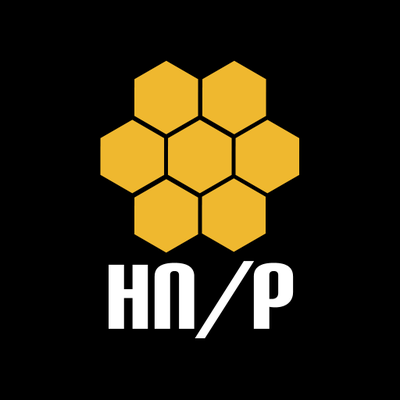

# Intel Owl

Do you want to get **threat intelligence data** about a malware, an IP or a domain? Do you want to get this kind of data from multiple sources at the same time using **a single API request**?

You are in the right place!

Intel Owl is an Open Source Intelligence, or OSINT solution to get threat intelligence data about a specific file, an IP or a domain from a single API at scale. It integrates a number of analyzers available online and a lot of cutting-edge malware analysis tools. It is for everyone who needs a single point to query for info about a specific file or observable.

### Features

- Provides enrichment of Threat Intel for malware as well as observables (IP, Domain, URL, hash, etc).
- This application is built to **scale out** and to **speed up the retrieval of threat info**.
- Thanks to the official libraries [pyintelowl](https://github.com/intelowlproject/pyintelowl) and [go-intelowl](https://github.com/intelowlproject/go-intelowl), it can be integrated easily in your stack of security tools to automate common jobs usually performed, for instance, by SOC analysts manually.
- Intel Owl is composed of:
  - **analyzers** that can be run to either retrieve data from external sources (like VirusTotal or AbuseIPDB) or to generate intel from internally available tools (like Yara or Oletools)
  - **connectors** that can be run to export data to external platforms (like MISP or OpenCTI)
  - **visualizers** that can be run to create custom visualizations of analyzers results
  - **playbooks** that are meant to make analysis easily repeatable
- API REST written in Django and Python 3.9.
- Built-in frontend client written in ReactJS, with **[certego-ui](https://github.com/certego/certego-ui)**: provides features such as dashboard, visualizations of analysis data, easy to use forms for requesting new analysis, etc.

### Documentation 
We try hard to keep our documentation well written, easy to understand and always updated.
All info about installation, usage, configuration and contribution can be found [here](https://intelowl.readthedocs.io/)

### Publications and Media

To know more about the project and its growth over time, you may be interested in reading [the official blog posts and/or videos about the project by clicking on this link](https://intelowl.readthedocs.io/en/latest/Introduction.html#publications-and-media)

### Available services or analyzers

You can see the full list of all available analyzers in the [documentation](https://intelowl.readthedocs.io/en/latest/Usage.html#available-analyzers).

| Type                                               | Analyzers Available                                                                                                                                                                                                                                                                                                                                                                                                                                                                                                                                                                                                                                                                                                                                                                                                                                                                                                                                                                                                                             |
| -------------------------------------------------- |-------------------------------------------------------------------------------------------------------------------------------------------------------------------------------------------------------------------------------------------------------------------------------------------------------------------------------------------------------------------------------------------------------------------------------------------------------------------------------------------------------------------------------------------------------------------------------------------------------------------------------------------------------------------------------------------------------------------------------------------------------------------------------------------------------------------------------------------------------------------------------------------------------------------------------------------------------------------------------------------------------------------------------------------------|
| Inbuilt modules                                    | - Static Office Document, RTF, PDF, PE File Analysis and metadata extraction  - Strings Deobfuscation and analysis ([FLOSS](https://github.com/mandiant/flare-floss), [Stringsifter](https://github.com/mandiant/stringsifter), ...)  - PE Emulation with [Qiling](https://github.com/qilingframework/qiling) and [Speakeasy](https://github.com/mandiant/speakeasy)  - PE Signature verification  - PE Capabilities Extraction ([CAPA](https://github.com/mandiant/capa))  - Javascript Emulation ([Box-js](https://github.com/CapacitorSet/box-js))  - Android Malware Analysis ([Quark-Engine](https://github.com/quark-engine/quark-engine), ...)  - SPF and DMARC Validator  - Yara (a lot of public rules are available. You can also add your own rules)  - more...                                                                                                                                                                                                                                  |
| External services                                  | - Abuse.ch <a href="https://bazaar.abuse.ch/about/" target="_blank">MalwareBazaar</a>/<a href="https://urlhaus.abuse.ch/" target="_blank">URLhaus</a>/<a href="https://threatfox.abuse.ch/about/" target="_blank">Threatfox</a>/<a href="https://yaraify.abuse.ch/about/" target="_blank">YARAify</a>  - <a href="https://dragonfly.certego.net?utm_source=intelowl" target="_blank">Dragonfly sandbox</a>  - <a href="https://docs.greynoise.io/docs/3rd-party-integrations" target="_blank"> GreyNoise v2</a>  - <a href="https://analyze.intezer.com/?utm_source=IntelOwl" target="_blank"> Intezer</a>  - VirusTotal v3  - <a href="https://doc.crowdsec.net/docs/next/cti_api/integration_intelowl/?utm_source=IntelOwl" target="_blank"> Crowdsec</a>  - <a href="https://urlscan.io/docs/integrations/" target="_blank">URLscan</a>  - Shodan  - AlienVault OTX  - <a href="https://intelx.io/integrations" target="_blank">Intelligence_X</a>  - <a href="https://www.misp-project.org/" target="_blank">MISP</a>  - many more.. |

## Partnerships and sponsors

As open source project maintainers, we strongly rely on external support to get the resources and time to work on keeping the project alive, with a constant release of new features, bug fixes and general improvements.

Because of this, we joined [Open Collective](https://opencollective.com/intelowl-project) to obtain non-profit equal level status which allows the organization to receive and manage donations transparently. Please support IntelOwl and all the community by choosing a plan (BRONZE, SILVER, etc).

### 🥇 GOLD

#### Certego

[Certego](https://certego.net/?utm_source=intelowl) is a MDR (Managed Detection and Response) and Threat Intelligence Provider based in Italy.

IntelOwl was born out of Certego's Threat intelligence R&D division and is constantly maintained and updated thanks to them.

> [Dragonfly](https://dragonfly.certego.net/?utm_source=intelowl), an automated sandbox to emulate and analyze malware, is a new public service by Certego developed by the same team behind IntelOwl. It is now available as the `Dragonfly_Emulation` analyzer in IntelOwl. [Sign up](https://dragonfly.certego.net/register?utm_source=intelowl) on Dragonfly today for free access!

#### The Honeynet Project

[The Honeynet Project](https://www.honeynet.org) is a non-profit organization working on creating open source cyber security tools and sharing knowledge about cyber threats.

Thanks to Honeynet, we are hosting a public demo of the application [here](https://intelowl.honeynet.org). If you are interested, please contact a member of Honeynet to get access to the public service.

#### Google Summer of Code

Since its birth this project has been participating in the [Google Summer of Code](https://summerofcode.withgoogle.com/) (GSoC)!

If you are interested in participating in the next Google Summer of Code, check all the info available in the [dedicated repository](https://github.com/intelowlproject/gsoc)!

### 🥈 SILVER

#### ThreatHunter.ai

[ThreatHunter.ai®](https://threathunter.ai?utm_source=intelowl), is a 100% Service-Disabled Veteran-Owned Small Business started in 2007 under the name Milton Security Group. ThreatHunter.ai is the global leader in Dynamic Threat Hunting. Operating a true 24x7x365 Security Operation Center with AI/ML-enhanced human Threat Hunters, ThreatHunter.ai has changed the industry in how threats are found, and mitigated in real time. For over 15 years, our teams of Threat Hunters have stopped hundreds of thousands of threats and assisted organizations in defending against threat actors around the clock.

### 🥉 BRONZE

#### Docker

In 2021 IntelOwl joined the official [Docker Open Source Program](https://www.docker.com/blog/expanded-support-for-open-source-software-projects/). This allows IntelOwl developers to easily manage Docker images and focus on writing the code. You may find the official IntelOwl Docker images [here](https://hub.docker.com/search?q=intelowlproject).

### Other collaborations
 * [LimaCharlie](https://limacharlie.io/blog/limacharlie-sponsors-intel-owl/?utm_source=intelowl&utm_medium=banner)
 * [Tines](https://www.tines.com/blog/announcing-our-sponsorship-of-intel-owl?utm_source=oss&utm_medium=sponsorship&utm_campaign=intelowl)

## About the author and maintainers

Feel free to contact the main developers at any time on Twitter:

- [Matteo Lodi](https://twitter.com/matte_lodi): Author and creator
- [Eshaan Bansal](https://twitter.com/eshaan7_): Principal maintainer
- [Simone Berni](https://twitter.com/0ssig3no): Key Contributor and Backend Maintainer
- [Daniele Rosetti](https://github.com/drosetti): Key Contributor and Frontend Maintainer