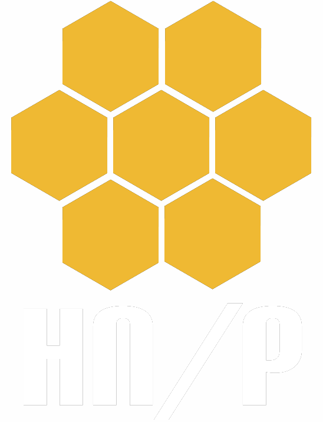

# Intel Owl

Do you want to get **threat intelligence data** about a malware, an IP or a domain? Do you want to get this kind of data from multiple sources at the same time using **a single API request**?

You are in the right place!

Intel Owl is an Open Source Intelligence, or OSINT solution to get threat intelligence data about a specific file, an IP or a domain from a single API at scale. It integrates a number of analyzers available online and a lot of cutting-edge malware analysis tools. It is for everyone who needs a single point to query for info about a specific file or observable.

### Features

- Provides enrichment of threat intel for malware as well as observables (IP, Domain, URL and hash).
- This application is built to **scale out** and to **speed up the retrieval of threat info**.
- It can be integrated easily in your stack of security tools ([pyintelowl](https://github.com/intelowlproject/pyintelowl)) to automate common jobs usually performed, for instance, by SOC analysts manually.
- Intel Owl is composed of:
  - **analyzers** that can be run to retrieve data from external sources (like VirusTotal or AbuseIPDB) or to generate intel from internal analyzers (like Yara or Oletools)
  - **connectors** that can be run to export data to external platforms
- API written in Django and Python 3.9.
- Inbuilt frontend client: **[IntelOwl-ng](https://github.com/intelowlproject/IntelOwl-ng)** provides features such as dashboard, visualizations of analysis data, easy to use forms for requesting new analysis, etc. [Live Demo](https://intelowlclient.firebaseapp.com/).

## Documentation 

Documentation about IntelOwl installation, usage, configuration and contribution can be found at https://intelowl.readthedocs.io/.

## Blog posts

To know more about the project and it's growth over time, you may be interested in reading the following:

- [Honeynet: v3.0.0 Announcement](https://www.honeynet.org/2021/09/13/intel-owl-release-v3-0-0/)
- [Intel Owl on Daily Swig](https://portswigger.net/daily-swig/intel-owl-osint-tool-automates-the-intel-gathering-process-using-a-single-api)
- [Honeynet: v1.0.0 Announcement](https://www.honeynet.org/?p=7558)
- [Certego Blog: First announcement](https://www.certego.net/en/news/new-year-new-tool-intel-owl/)

## Available services or analyzers

You can see the full list of all available analyzers in the [documentation](https://intelowl.readthedocs.io/en/latest/Usage.html#available-analyzers) or [live demo](https://intelowlclient.firebaseapp.com/pages/analyzers/table).

| Type                                               | Analyzers Available                                                                                                                                                                                                                                                                                            |
| -------------------------------------------------- | -------------------------------------------------------------------------------------------------------------------------------------------------------------------------------------------------------------------------------------------------------------------------------------------------------------- |
| Inbuilt modules                                    | - Static Document, RTF, PDF, PE, Generic File Analysis  - Strings analysis with ML  - PE Emulation with Speakeasy  - PE Signature verification  - PE Capabilities Extraction  - Emulated Javascript Analysis  - Android Malware Analysis  - SPF and DMARC Validator  - more... |
| External services                                  | - <a href="https://dragonfly.certego.net?utm_source=intelowl" target="_blank">Dragonfly malware sandbox</a>  - <a href="https://docs.greynoise.io/docs/3rd-party-integrations" target="_blank"> GreyNoise v2</a>  - <a href="https://analyze.intezer.com/?utm_source=IntelOwl" target="_blank"> Intezer</a>  - VirusTotal v2+v3  - HybridAnalysis  - <a href="https://urlscan.io/docs/integrations/" target="_blank">URLscan</a>  - Shodan  - AlienVault OTX  - <a href="https://intelx.io/integrations" target="_blank">Intelligence_X</a>  - Abuse.ch <a href="https://bazaar.abuse.ch/about/" target="_blank">MalwareBazaar</a>/<a href="https://threatfox.abuse.ch/about/" target="_blank">Threatfox</a>  - many more.. |
| Free modules that require additional configuration | - Cuckoo (requires at least one working Cuckoo instance)  - MISP (requires at least one working MISP instance)  - Yara (a lot of public rules area available. There's also the chance to add your own rules)                                                                                           |

## Partnerships and sponsors

We have an official sponsorship program for companies, organizations and individuals who support IntelOwl development. For more details on how to join the list below, read the page: [Partnership and sponsors](https://github.com/certego/IntelOwl/blob/master/.github/partnership_and_sponsors.md).

### 🥇 GOLD

#### Certego

[Certego](https://certego.net/?utm_source=intelowl) is a MSSP and Threat Intelligence Provider based in Italy.

IntelOwl was born out of Certego's Threat intelligence R&D division and is constantly maintained and updated thanks to them.

> [Dragonfly](https://dragonfly.certego.net/?utm_source=intelowl), an automated sandbox to emulate and analyze malware, is a new public service by Certego developed by the same team behind IntelOwl. It is now available as the `Dragonfly_Emulation` analyzer in IntelOwl. [Sign up](https://dragonfly.certego.net/register?utm_source=intelowl) on Dragonfly today for free access!

#### The Honeynet Project

[The Honeynet Project](https://www.honeynet.org) is a non-profit organization working on creating open source cyber security tools and sharing knowledge about cyber threats.

Since its birth, thanks to this organization, this project has been participating in the [Google Summer of Code](https://summerofcode.withgoogle.com/) (GSoC)!

Project Summaries and/or in-development projects:

- 2020: [Eshaan Bansal](https://twitter.com/eshaan7_): [IntelOwl Work Product](https://www.honeynet.org/2020/08/26/gsoc-2020-work-product%e2%80%8a-%e2%80%8aintel-owl/)
- 2021:
  - [Sarthak Khattar](https://twitter.com/Mr_Momo07): [IntelOwl Improvements](https://www.honeynet.org/2021/08/20/gsoc-2021-project-summary-intelowl-improvements/)
  - [Shubham Pandey](https://twitter.com/imshubham31): [IntelOwl Connectors Manager and Integrations](https://www.honeynet.org/2021/08/20/gsoc-2021-project-summary-intelowl-connectors-manager-and-integrations/)

If you are interested in being the next GSoC developer for IntelOwl, join the [Honeynet Slack chat](https://gsoc-slack.honeynet.org/) for more info.

(Plus we have just started a new project called [GreedyBear](https://github.com/honeynet/GreedyBear) that will be proposed to the GSoC too.)

### 🥉 BRONZE

#### Tines

[Tines](https://www.tines.com/?utm_source=oss&utm_medium=sponsorship&utm_campaign=intelowl) is no-code automation for security teams. Build powerful, reliable workflows without a development team.

IntelOwl is officially integrated in Tines. Read everything about this partnership [in the Tines' blog](https://www.tines.com/blog/announcing-our-sponsorship-of-intel-owl?utm_source=oss&utm_medium=sponsorship&utm_campaign=intelowl)

#### Docker

In 2021 IntelOwl joined the official [Docker Open Source Program](https://www.docker.com/blog/expanded-support-for-open-source-software-projects/). This allows IntelOwl developers to easily manage Docker images and focus on writing the code.

### 🤝 IRON

If you are an individual who likes this project and want to thank us with a little contribution, we would be happy to list you here in the README as a public acknowledgment.

## About the author and maintainers

Feel free to contact the main developers at any time on twitter:

- [Matteo Lodi](https://twitter.com/matte_lodi): Author and creator
- [Eshaan Bansal](https://twitter.com/eshaan7_): Principal maintainer
