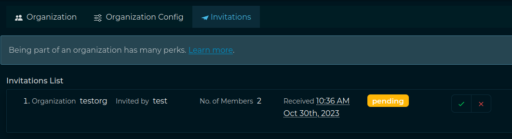

# Advanced Usage

This page includes details about some advanced features that Intel Owl provides which can be **optionally** enabled. Namely,

- [Advanced Usage](#advanced-usage)
  - [Organizations and User Management](#organizations-and-user-management)
    - [Multi Tenancy](#multi-tenancy)
    - [Registration](#registration)
  - [Optional Analyzers](#optional-analyzers)
  - [Customize analyzer execution](#customize-analyzer-execution)
    - [from the GUI](#from-the-gui)
    - [from Pyintelowl](#from-pyintelowl)
    - [CyberChef](#cyberchef)
    - [PhoneInfoga](#phoneinfoga)
  - [Analyzers with special configuration](#analyzers-with-special-configuration)
  - [Notifications](#notifications)


## Organizations and User management

Starting from IntelOwl v4, a new "Organization" section is available on the GUI. This section substitute the previous permission management via Django Admin and aims to provide an easier way to manage users and visibility.

### Multi Tenancy

Thanks to the "Organization" feature, IntelOwl can be used by multiple SOCs, companies, etc...very easily.
Right now it works very simply: only users in the same organization can see analysis of one another. An user can belong to an organization only.

#### Manage organizations

You can create a new organization by going to the "Organization" section, available under the Dropdown menu you cand find under the username.

Once you create an organization, you are the unique "Owner" of that organization. So you are the only one who can delete the organization and promote/demote/kick users.
Another role, which is called "Admin", can be set to a user (via the Django Admin interface only for now).
Owners and admins share the following powers: they can manage invitations and the organization's plugin configuration.

#### Accept Invites

Once an invite has sent, the invited user has to login, go to the "Organization" section and accept the invite there. Afterwards the Administrator will be able to see the user in his "Organization" section.



#### Plugins Params and Secrets

From IntelOwl v4.1.0, Plugin Parameters and Secrets can be defined at the organization level, in the dedicated section.
This allows to share configurations between users of the same org while allowing complete multi-tenancy of the application.
Only Owners and Admins of the organization can set, change and delete them.

#### Disable Plugins at Org level

The org admin can disable a specific plugin for all the users in a specific org.
To do that, Org Admins needs to go in the "Plugins" section and click the button "Enabled for organization" of the plugin that they want to disable.


### Registration
Since IntelOwl v4.2.0 we added a Registration Page that can be used to manage Registration requests when providing IntelOwl as a Service.

After a user registration has been made, an email is sent to the user to verify their email address. If necessary, there are buttons on the login page to resend the verification email and to reset the password.

Once the user has verified their email, they would be manually vetted before being allowed to use the IntelOwl platform. The registration requests would be handled in the Django Admin page by admins.
If you have IntelOwl deployed on an AWS instance with an IAM role you can use the [SES](/Advanced-Usage.md#ses) service.

To have the "Registration" page to work correctly, you must configure some variables before starting IntelOwl. See [Optional Environment Configuration](https://intelowl.readthedocs.io/en/latest/Installation.html#other-optional-configuration-to-enable-specific-services-features)

In a development environment the emails that would be sent are written to the standard output.

#### Recaptcha configuration
The Registration Page contains a Recaptcha form from Google. By default, that Recaptcha is not configured and is not shown.

If your intention is to publish IntelOwl as a Service you should first remember to comply to the [AGPL License](https://github.com/intelowlproject/IntelOwl/blob/master/LICENSE).

Then you need to add the generated Recaptcha Secret in the `RECAPTCHA_SECRET_KEY` value in the `env_file_app` file.

Afterwards you should configure the Recaptcha Key for your site and add that value in the `RECAPTCHA_SITEKEY` in the `frontend/public/env.js` file.
In that case, you would need to [re-build](/Installation.md#update-and-rebuild) the application to have the changes properly reflected.


## Optional Analyzers

Some analyzers which run in their own Docker containers are kept disabled by default. They are disabled by default to prevent accidentally starting too many containers and making your computer unresponsive.

<style>
table, th, td {
  padding: 5px;
  border: 1px solid black;
  border-collapse: collapse;
}
</style>
<table style="width:100%">
  <tr>
    <th>Name</th>
    <th>Analyzers</th>
    <th>Description</th>
  </tr>
  <tr>
    <td>Malware Tools Analyzers</td>
    <td>
      <ul>
      <li><code>PEframe_Scan</code></li>
      <li><code>Capa_Info</code></li>
      <li><code>Floss</code></li>
      <li><code>Strings_Info</code></li>
      <li><code>ClamAV</code></li>
      <li><code>APKiD</code></li>
      <li><code>Thug_URL_Info</code>,
      <code>Thug_HTML_Info</code></li>
      <li><code>BoxJS</code></li>
      <li><code>Qiling_Windows</code>,
      <code>Qiling_Windows_Shellcode</code>,
      <code>Qiling_Linux</code>,
      <code>Qiling_Linux_Shellcode</code></li>
     </ul>
    </td>
    <td>
    <ul>
      <li>PEFrame performs static analysis on Portable Executable malware and malicious MS Office documents</li>
      <li>Capa detects capabilities in executable files</li>
      <li>FLOSS automatically deobfuscate strings from malware binaries</li>
      <li>String_Info_Classic extracts human-readable strings where as ML version of it ranks them</li>
      <li>ClamAV antivirus engine scans files for trojans, viruses, malwares using a multi-threaded daemon</li>
      <li>APKiD identifies many compilers, packers, obfuscators, and other weird stuff from an APK or DEX file.</li>
      <li>Thug performs hybrid dynamic/static analysis on a URL or HTML page.</li>
      <li>Box-JS is a tool for studying JavaScript malware</li>
      <li>Qiling is a tool for emulating the execution of a binary file or a shellcode.
     It requires the configuration of its rootfs, and the optional configuration of profiles.
     The rootfs can be copied from the <a href="https://github.com/qilingframework/qiling/tree/master/examples/rootfs"> Qiling project</a>: please remember that Windows dll <b> must</b> be manually added for license reasons.
     Qiling provides a <a href="https://github.com/qilingframework/qiling/blob/master/examples/scripts/dllscollector.bat"> DllCollector</a> to retrieve dlls from your licensed Windows. 
     <a href="https://docs.qiling.io/en/latest/profile/"> Profiles </a> must be placed in the <code>profiles</code> subfolder
     </li>
      </ul>
    </td>
  </tr>
  <tr>
    <td>TOR Analyzers</td>
    <td><code>Onionscan</code></td>
    <td>Scans TOR .onion domains for privacy leaks and information disclosures.</td>
  </tr>
  <tr>
    <td>CyberChef</td>
    <td><code>CyberChef</code></td>
    <td>Run a transformation on a <a href="https://github.com/gchq/CyberChef-server">CyberChef server</a> using pre-defined or custom recipes(rules that describe how the input has to be transformed). Check further instructions <a href="#cyberchef">here</a></td>
  </tr>
    <tr>
    <td>PCAP Analyzers</td>
    <td><code>Suricata</code></td>
    <td>You can upload a PCAP to have it analyzed by Suricata with the open Ruleset. The result will provide a list of the triggered signatures plus a more detailed report with all the raw data generated by Suricata. You can also add your own rules (See paragraph "Analyzers with special configuration"). The installation is optimized for scaling so the execution time is really fast.</td>
  </tr>
  <tr>
    <td>PhoneInfoga</td>
    <td><code>PhoneInfoga_scan</code></td>
    <td><a href="https://github.com/sundowndev/phoneinfoga/tree/master">PhoneInfoga</a> is one of the most advanced tools to scan international phone numbers. It allows you to first gather basic information such as country, area, carrier and line type, then use various techniques to try to find the VoIP provider or identify the owner. It works with a collection of scanners that must be configured in order for the tool to be effective. PhoneInfoga doesn't automate everything, it's just there to help investigating on phone numbers. <a href="#phoneinfoga">here</a></td>
  </tr>
</table>

To enable all the optional analyzers you can add the option `--all_analyzers` when starting the project. Example:

```bash
./start prod up --all_analyzers
```

Otherwise you can enable just one of the cited integration by using the related option. Example:

```bash
./start prod up --tor_analyzers
```

## Customize analyzer execution

Some analyzers provide the chance to customize the performed analysis based on parameters that are different for each analyzer.

##### from the GUI

You can click on "**Runtime Configuration**"  button in the "Scan" page and add the runtime configuration in the form of a dictionary.
Example:

```javascript
"VirusTotal_v3_File": {
    "force_active_scan_if_old": true
}
```

##### from [Pyintelowl](https://github.com/intelowlproject/pyintelowl)

While using `send_observable_analysis_request` or `send_file_analysis_request` endpoints, you can pass the parameter `runtime_configuration` with the optional values.
Example:

```python
runtime_configuration = {
    "Doc_Info": {
        "additional_passwords_to_check": ["passwd", "2020"]
    }
}
pyintelowl_client.send_file_analysis_request(..., runtime_configuration=runtime_configuration)
```
#### PhoneInfoga
PhoneInfoga provides several [Scanners](https://sundowndev.github.io/phoneinfoga/getting-started/scanners/) to extract as much information as possible from a given phone number. Those scanners may require authentication, so they're automatically skipped when no authentication credentials are found.

By default the scanner used is `local`.
Go through this [guide](https://sundowndev.github.io/phoneinfoga/getting-started/scanners/) to initiate other required API keys related to this analyzer.
#### CyberChef

You can either use pre-defined recipes or create your own as
explained [here](https://github.com/gchq/CyberChef-server#features).

To use a pre-defined recipe, set the `predefined_recipe_name` argument to the name of the recipe as
defined [here](#pre-defined-recipes). Else, leave the `predefined_recipe_name` argument empty and set
the `custom_recipe` argument to the contents of
the [recipe](https://github.com/gchq/CyberChef-server#example-one-operation-non-default-arguments-by-name) you want to
use.

Additionally, you can also (optionally) set the `output_type` argument.

##### Pre-defined recipes

- "to decimal": `[{"op": "To Decimal", "args": ["Space", False]}]`

## Analyzers with special configuration

Some analyzers could require a special configuration:

- `GoogleWebRisk`: this analyzer needs a service account key with the Google Cloud credentials to work properly.
  You should follow the [official guide](https://cloud.google.com/web-risk/docs/quickstart) for creating the key.
  Then you can populate the secret `service_account_json` for that analyzer with the JSON of the service account file.

- `ClamAV`: this Docker-based analyzer uses `clamd` daemon as its scanner and is communicating with `clamdscan` utility to scan files. The daemon requires 2 different configuration files: `clamd.conf`(daemon's config) and `freshclam.conf` (virus database updater's config). These files are mounted as docker volumes in `/integrations/malware_tools_analyzers/clamav` and hence, can be edited by the user as per needs, without restarting the application. Moreover ClamAV is integrated with unofficial open source signatures extracted with [Fangfrisch](https://github.com/rseichter/fangfrisch). The configuration file `fangfrisch.conf` is mounted in the same directory and can be customized on your wish. For instance, you should change it if you want to integrate open source signatures from [SecuriteInfo](https://www.securiteinfo.com/) 

- `Suricata`: you can customize the behavior of Suricata:

  - `/integrations/pcap_analyzers/config/suricata/rules`: here there are Suricata rules. You can change the `custom.rules` files to add your own rules at any time. Once you made this change, you need to either restart IntelOwl or (this is faster) run a new analysis with the Suricata analyzer and set the parameter `reload_rules` to `true`.
  - `/integrations/pcap_analyzers/config/suricata/etc`: here there are Suricata configuration files. Change it based on your wish. Restart IntelOwl to see the changes applied.

- `Yara`: 
  - You can customize both the `repositories` parameter and `private_repositories` secret to download and use different rules from the default that IntelOwl currently support.
    - The `repositories` values is what will be used to actually run the analysis: if you have added private repositories, remember to add the url in `repositories` too! 
  - You can add local rules inside the directory at `/opt/deploy/files_required/yara/YOUR_USERNAME/custom_rules/`. Please remember that these rules are not synced in a cluster deploy: for this reason is advised to upload them on GitHub and use the `repositories` or `private_repositories` attributes.

## Notifications

Since v4, IntelOwl integrated the notification system from the `certego_saas` package, allowing the admins to create notification that every user will be able to see.

The user would find the Notifications button on the top right of the page:


There the user can read notifications provided by either the administrators or the IntelOwl Maintainers.

As an Admin, if you want to add a notification to have it sent to all the users, you have to login to the Django Admin interface, go to the "Notifications" section and add it there.
While adding a new notification, in the `body` section it is possible to even use HTML syntax, allowing to embed images, links, etc;
in the `app_name field`, please remember to use `intelowl` as the app name.

Everytime a new release is installed, once the backend goes up it will automatically create a new notification,
having as content the latest changes described in the [CHANGELOG.md](https://github.com/intelowlproject/IntelOwl/blob/master/.github/CHANGELOG.md),
allowing the users to keep track of the changes inside intelowl itself.

