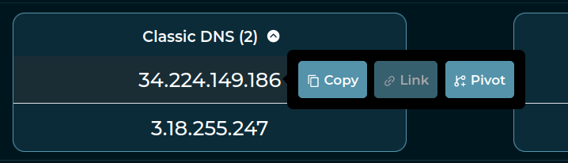
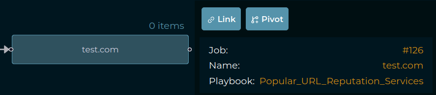
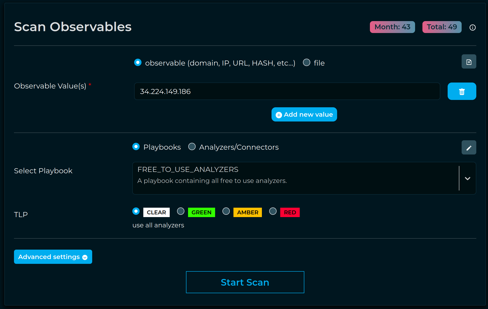
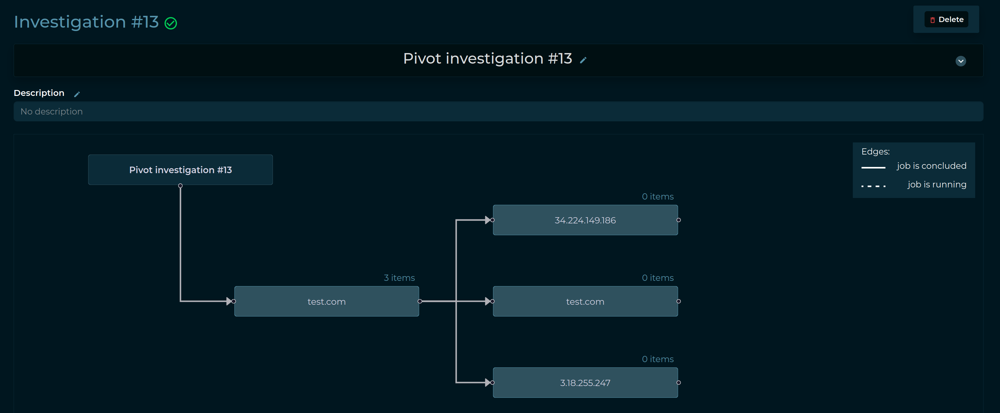
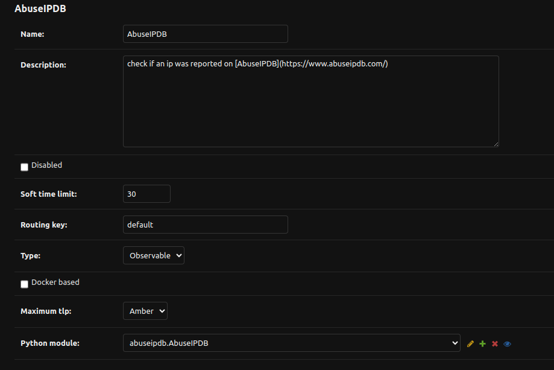
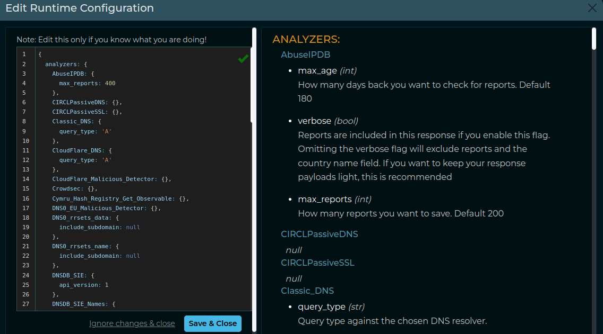
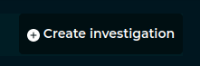
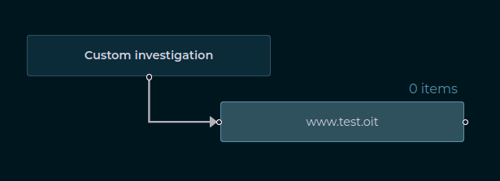
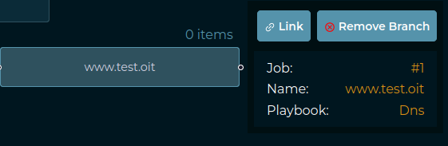
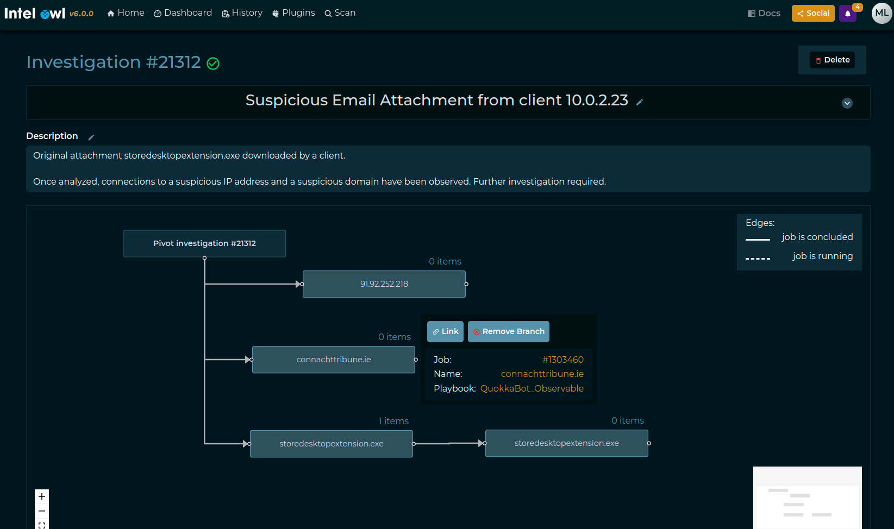

# Usage

This page includes the most important things to know and understand when using IntelOwl.

- [How to interact with IntelOwl](#how-to-interact-with-intelowl)
- [Plugins Framework](#plugins-framework)
  - [Analyzers](#analyzers)
  - [Connectors](#connectors)
  - [Pivots](#pivots)
  - [Visualizers](#visualizers)
  - [Ingestors](#ingestors)
  - [Playbooks](#playbooks)
  - [Generic Plugin Creation, Configuration and Customization](#generic-plugin-creation-configuration-and-customization)
  - [Enabling or Disabling Plugins](#enabling-or-disabling-plugins)
  - [Special Plugins operations](#special-plugins-operations)
  - [TLP Support](#tlp-support)
- [Investigations Framework](#investigations-framework)
  - [Create and populate an Investigation](#create-and-populate-an-investigation)

## How to interact with IntelOwl

Intel Owl main objective is to provide a single API interface to query in order to retrieve threat intelligence at scale.

There are multiple ways to interact with the Intel Owl APIs,

1. Web Interface

   - Built-in Web interface with dashboard, visualizations of analysis data, easy to use forms for requesting new analysis, tags management and more features
   
2. pyIntelOwl (CLI/SDK)

   - Official Python client that is available at: [PyIntelOwl](https://github.com/intelowlproject/pyintelowl),
   - Can be used as a library for your own python projects or...
   - directly via the command line interface.

3. goIntelOwl (CLI/SDK)
   - Official GO client that is available at: [go-intelowl](https://github.com/intelowlproject/go-intelowl)

Hint: Tokens Creation

The server authentication is managed by API tokens. So, if you want to interact with Intel Owl, you have two ways to do that:
<ul>
<li>If you are a normal user, you can go to the "API Access/Sessions" section of the GUI and create a Token there.</li>
<li>If you are an administrator of IntelOwl, you can create one or more unprivileged users from the Django Admin Interface and then generate a token for those users.
</li>
</ul>
Afterwards you can leverage the created tokens with the Intel Owl Client.

## Plugins Framework

Plugins are the core modular components of IntelOwl that can be easily added, changed and customized.
There are several types of plugins:

- [Analyzers](#analyzers)
- [Connectors](#connectors)
- [Pivots](#pivots)
- [Visualizers](#visualizers)
- [Ingestors](#ingestors)
- [Playbooks](#playbooks)

### Analyzers

Analyzers are the most important plugins in IntelOwl. They allow to perform data extraction on the observables and/or files that you would like to analyze.

#### Analyzers list

The following is the list of the available analyzers you can run out-of-the-box. You can also navigate the same list via the

- Graphical Interface: once your application is up and running, go to the "Plugins" section
- [pyintelowl](https://github.com/intelowlproject/pyintelowl): `$ pyintelowl get-analyzer-config`

##### File analyzers:

###### Internal tools
* `APKiD`: [APKiD](https://github.com/rednaga/APKiD) identifies many compilers, packers, obfuscators, and other weird stuff from an APK or DEX file.
* `BoxJS_Scan_Javascript`: [Box-JS](https://github.com/CapacitorSet/box-js) is a tool for studying JavaScript malware.
* `Capa_Info`: [Capa](https://github.com/mandiant/capa) detects capabilities in executable files
* `Capa_Info_Shellcode`: [Capa](https://github.com/mandiant/capa) detects capabilities in shellcode
* `ClamAV`: scan a file via the [ClamAV AntiVirus Engine](https://www.clamav.net/). IntelOwl automatically keep ClamAV updated with official and [unofficial](https://github.com/rseichter/fangfrisch) open source signatures
* `Doc_Info`: static document analysis with new features to analyze XLM macros, encrypted macros and more (combination of Oletools and XLMMacroDeobfuscator)
* `ELF_Info`: static ELF analysis with [pyelftools](https://github.com/eliben/pyelftools) and [telfhash](https://github.com/trendmicro/telfhash)
* `File_Info`: static generic File analysis (hashes, magic and [exiftool](https://exiftool.org/))
* `Floss`: [Mandiant Floss](https://github.com/mandiant/flare-floss) Obfuscated String Solver in files
* `Hfinger`: create fingerprints of malware HTTPS requests using [Hfinger](https://github.com/CERT-Polska/hfinger)
* `PE_Info`: static PE analysis with [pefile](https://github.com/mlodic/pefile)
* `PEframe_Scan`: Perform static analysis on Portable Executable malware and malicious MS Office documents with [PeFrame](https://github.com/guelfoweb/peframe)
* `Permhash`: create hash of manifest permssions found in APK, Android manifest, Chrome extensions or Chrome extension manifest using [Permhash](https://github.com/google/permhash)
* `PDF_Info`: static PDF analysis ([peepdf](https://github.com/jesparza/peepdf) + [pdfid](https://github.com/mlodic/pdfid))
* `Qiling_Linux`: [Qiling](https://github.com/qilingframework/qiling) qiling linux binary emulation.
* `Qiling_Linux_Shellcode`: [Qiling](https://github.com/qilingframework/qiling) qiling linux shellcode emulation.
* `Qiling_Windows`: [Qiling](https://github.com/qilingframework/qiling) qiling windows binary emulation.
* `Qiling_Windows_Shellcode`: [Qiling](https://github.com/qilingframework/qiling) qiling windows shellcode emulation.
* `Quark_Engine`: [Quark Engine](https://github.com/quark-engine/quark-engine) is an Obfuscation-Neglect Android Malware Scoring System.
* `Rtf_Info`: static RTF analysis ([Oletools](https://github.com/decalage2/oletools))
* `Signature_Info`: PE signature extractor with [osslsigncode](https://github.com/mtrojnar/osslsigncode)
* `Speakeasy`: [Mandiant Speakeasy](https://github.com/mandiant/speakeasy) binary emulation
* `SpeakEasy_Shellcode`: [Mandiant Speakeasy](https://github.com/mandiant/speakeasy) shellcode emulation
* `Strings_Info`: Strings extraction. Leverages Mandiant's [Stringsifter](https://github.com/mandiant/stringsifter)
* `Suricata`: Analyze PCAPs with open IDS signatures with [Suricata engine](https://github.com/OISF/suricata)
* `Thug_HTML_Info`: Perform hybrid dynamic/static analysis on a HTML file using [Thug low-interaction honeyclient](https://thug-honeyclient.readthedocs.io/)
* `Xlm_Macro_Deobfuscator`: [XlmMacroDeobfuscator](https://github.com/DissectMalware/XLMMacroDeobfuscator) deobfuscate xlm macros
* `Yara`: scan a file with
  * [ATM malware yara rules](https://github.com/fboldewin/YARA-rules)
  * [bartblaze yara rules](https://github.com/bartblaze/Yara-rules)
  * [community yara rules](https://github.com/Yara-Rules/rules)
  * [StrangerealIntel](https://github.com/StrangerealIntel) 
  * [Neo23x0 yara rules](https://github.com/Neo23x0/signature-base)
  * [Intezer yara rules](https://github.com/intezer/yara-rules)
  * [Inquest yara rules](https://github.com/InQuest/yara-rules)
  * [McAfee yara rules](https://github.com/advanced-threat-research/Yara-Rules)
  * [Samir Threat Hunting yara rules](https://github.com/sbousseaden/YaraHunts)
  * [Stratosphere yara rules](https://github.com/stratosphereips/yara-rules)
  * [Mandiant yara rules](https://github.com/mandiant/red_team_tool_countermeasures)
  * [ReversingLabs yara rules](https://github.com/reversinglabs/reversinglabs-yara-rules)
  * [YARAify rules](https://yaraify.abuse.ch/api/#download-yara-package)
  * [SIFalcon rules](https://github.com/SIFalcon/Detection/)
  * [Elastic rules](https://github.com/elastic/protections-artifacts)
  * [JPCERTCC Yara rules](https://github.com/JPCERTCC/jpcert-yara)
  * [HuntressLab Yara rules](https://github.com/embee-research/Yara)
  * [elceef Yara Rules](https://github.com/elceef/yara-rulz)
  * [dr4k0nia Yara rules](https://github.com/dr4k0nia/yara-rules)
  * [Facebook Yara rules](https://github.com/facebook/malware-detection)
  * [edelucia Yara rules](https://github.com/edelucia/rules/tree/main/yara)
  * [LOLDrivers Yara Rules](https://github.com/magicsword-io/LOLDrivers)
  * your own added signatures. See [Advanced-Usage](./Advanced-Usage.html#analyzers-with-special-configuration) for more details.

###### External services

- `CapeSandbox`: [CAPESandbox](https://capesandbox.com) automatically scans suspicious files using the CapeSandbox API. Analyzer works for private instances as well.
- `Cymru_Hash_Registry_Get_File`: Check if a particular file is known to be malware by [Team Cymru](https://team-cymru.com/community-services/mhr/)
- `Cuckoo_Scan`: scan a file on Cuckoo (this analyzer is disabled by default. You have to change that flag [in the config](https://github.com/intelowlproject/IntelOwl/blob/master/configuration/analyzer_config.json) to use it)
- `DocGuard_Upload_File`: Analyze office files in seconds. [DocGuard](https://www.docguard.io).
- `Dragonfly_Emulation`: Emulate malware against [Dragonfly](https://dragonfly.certego.net?utm_source=intelowl) sandbox by [Certego S.R.L](https://certego.net?utm_source=intelowl).
- `FileScan_Upload_File`: Upload your file to extract IoCs from executable files, documents and scripts via [FileScan.io API](https://www.filescan.io/api/docs).
- `HashLookupServer_Get_File`: check if a md5 or sha1 is available in the database of [known file hosted by CIRCL](https://github.com/adulau/hashlookup-server)
- `HybridAnalysis_Get_File`: check file hash on [HybridAnalysis](https://www.hybrid-analysis.com/) sandbox reports
- `Intezer_Scan`: scan a file on [Intezer](https://analyze.intezer.com/?utm_source=IntelOwl). Register for a free community account [here](https://analyze.intezer.com/sign-in?utm_source=IntelOwl). With TLP `CLEAR`, in case the hash is not found, you would send the file to the service.
- `Malpedia_Scan`: scan a binary or a zip file (pwd:infected) against all the yara rules available in [Malpedia](https://malpedia.caad.fkie.fraunhofer.de/)
- `MalwareBazaar_Get_File`: Check if a particular malware sample is known to [MalwareBazaar](https://bazaar.abuse.ch/)
- `MISPFIRST_Check_Hash`: check a file hash on the [FIRST MISP](https://misp.first.org/) instance
- `MISP_Check_Hash`: check a file hash on a MISP instance
- `MWDB_Scan`: [mwdblib](https://mwdb.readthedocs.io/en/latest/) Retrieve malware file analysis from repository maintained by CERT Polska MWDB. With TLP `CLEAR`, in case the hash is not found, you would send the file to the service.
- `OTX_Check_Hash`: check file hash on [Alienvault OTX](https://otx.alienvault.com/)
- `SublimeSecurity`: Analyze an Email with [Sublime Security](https://docs.sublimesecurity.com/docs) live flow
- `Triage_Scan`: leverage [Triage](https://tria.ge) sandbox environment to scan various files
- `UnpacMe`: [UnpacMe](https://www.unpac.me/) is an automated malware unpacking service
- `Virushee_Scan`: Check file hash on [Virushee API](https://api.virushee.com/). With TLP `CLEAR`, in case the hash is not found, you would send the file to the service.
- `VirusTotal_v3_File`: check the file hash on VirusTotal. With TLP `CLEAR`, in case the hash is not found, you would send the file to the service.
- `YARAify_File_Scan`: scan a file against public and non-public YARA and ClamAV signatures in [YARAify](https://yaraify.abuse.ch/) public service
- `YARAify_File_Search`: scan an hash against [YARAify](https://yaraify.abuse.ch/) database
-  `Zippy_scan` : [Zippy](https://github.com/thinkst/zippy): Fast method to classify text as AI or human-generated; takes in `lzma`,`zlib`,`brotli` as input based engines; `ensemble` being default.
- `Blint`: [Blint](https://github.com/owasp-dep-scan/blint) is a Binary Linter that checks the security properties and capabilities of your executables. Supported binary formats: - Android (apk, aab) - ELF (GNU, musl) - PE (exe, dll) - Mach-O (x64, arm64)
##### Observable analyzers (ip, domain, url, hash)

###### Internal tools

- `CheckDMARC`: An SPF and DMARC DNS records validator for domains.
- `DNStwist`: Scan a url/domain to find potentially malicious permutations via dns fuzzing. [dnstwist repo](https://github.com/elceef/dnstwist)
- `Thug_URL_Info`: Perform hybrid dynamic/static analysis on a URL using [Thug low-interaction honeyclient](https://thug-honeyclient.readthedocs.io/)

###### External services

* `AbuseIPDB`: check if an ip was reported on [AbuseIPDB](https://www.abuseipdb.com/)
* `Abusix`: get abuse contacts of an IP address from [Abusix](https://abusix.com/contact-db/)
* `BGP Ranking`: [BGP-Ranking](https://github.com/D4-project/BGP-Ranking) provides a way to collect such malicious activities, aggregate the information per ASN and provide a ranking model to rank the ASN from the most malicious to the less malicious ASN.
* `Anomali_Threatstream_PassiveDNS`: Return information from passive dns of Anomali. On [Anomali Threatstream](https://www.anomali.com/products/threatstream) PassiveDNS Api. 
* `Auth0`: scan an IP against the Auth0 API
* `BinaryEdge`: Details about an Host. List of recent events for the specified host, including details of exposed ports and services using [IP query](https://docs.binaryedge.io/api-v2/#v2queryiptarget) and return list of subdomains known from the target domains using [domain query](https://docs.binaryedge.io/api-v2/#v2querydomainssubdomaintarget)
* `BitcoinAbuse` : Check a BTC address against bitcoinabuse.com, a public database of BTC addresses used by hackers and criminals.
* `Censys_Search`: scan an IP address against [Censys](https://censys.io/) View API
* `CheckPhish`: [CheckPhish](https://checkphish.ai/checkphish-api/) can detect phishing and fraudulent sites.
* `CIRCLPassiveDNS`: scan an observable against the CIRCL Passive DNS DB
* `CIRCLPassiveSSL`: scan an observable against the CIRCL Passive SSL DB
* `Classic_DNS`: Retrieve current domain resolution with default DNS
* `CloudFlare_DNS`: Retrieve current domain resolution with CloudFlare DoH (DNS over HTTPS)
* `CloudFlare_Malicious_Detector`: Leverages CloudFlare DoH to check if a domain is related to malware
* `Crowdsec`: check if an IP was reported on [Crowdsec](https://www.crowdsec.net/) Smoke Dataset
* `Cymru_Hash_Registry_Get_Observable`: Check if a particular hash is available in the malware hash registry of [Team Cymru](https://team-cymru.com/community-services/mhr/)
* `DNSDB`: scan an observable against the [Passive DNS Farsight Database](https://www.farsightsecurity.com/solutions/dnsdb/) (support both v1 and v2 versions)
* `DNS0_EU`: Retrieve current domain resolution with DNS0.eu DoH (DNS over HTTPS)
* `DNS0_EU_Malicious_Detector`: Check if a domain or an url is marked as malicious in DNS0.eu database ([Zero](https://www.dns0.eu/zero) service)
* `DocGuard_Get`: check if an hash was analyzed on DocGuard. [DocGuard](https://www.docguard.io)
* `Feodo_Tracker`: [Feodo Tracker](https://feodotracker.abuse.ch/) offers various blocklists, helping network owners to protect their users from Dridex and Emotet/Heodo.
* `FileScan_Search`: Finds reports and uploaded files by various tokens, like hash, filename, verdict, IOCs etc via [FileScan.io  API](https://www.filescan.io/api/docs).
* `FireHol_IPList`: check if an IP is in [FireHol's IPList](https://iplists.firehol.org/)
* `GoogleSafebrowsing`: Scan an observable against GoogleSafeBrowsing DB
* `GoogleWebRisk`: Scan an observable against WebRisk API (Commercial version of Google Safe Browsing). Check the [docs](https://intelowl.readthedocs.io/en/develop/Advanced-Usage.html#analyzers-with-special-configuration) to enable this properly
* `Google_DNS`: Retrieve current domain resolution with Google DoH (DNS over HTTPS)
* `GreedyBear`: scan an IP or a domain against the [GreedyBear](https://greedybear.honeynet.org/) API (requires API key)
* `GreyNoise`: scan an IP against the [Greynoise](https://www.greynoise.io/) API (requires API key)
* `GreyNoiseCommunity`: scan an IP against the [Community Greynoise API](https://www.greynoise.io/) (requires API key))
* `Greynoise_Labs`: scan an IP against the [Greynoise API](https://www.greynoise.io/) (requires authentication token which can be obtained from cookies on Greynoise website after launching the playground from [here](https://api.labs.greynoise.io/))
* `HashLookupServer_Get_Observable`: check if a md5 or sha1 is available in the database of [known file hosted by CIRCL](https://github.com/adulau/hashlookup-server)
* `HoneyDB_Get`: [HoneyDB](https://honeydb.io/) IP lookup service
* `HoneyDB_Scan_Twitter`: scan an IP against HoneyDB.io's Twitter Threat Feed
* `Hunter_How`: Scans IP and domain against [Hunter_How API](https://hunter.how/search-api).
* `Hunter_Io`: Scans a domain name and returns set of data about the organisation, the email address found and additional information about the people owning those email addresses.
* `HybridAnalysis_Get_Observable`: search an observable in the [HybridAnalysis](https://www.hybrid-analysis.com/) sandbox reports
* `IP2WHOIS`: [API Docs](https://www.ip2location.io/ip2whois-documentation) IP2Location.io IP2WHOIS Domain WHOIS API helps users to obtain domain information and WHOIS record by using a domain name.
* `IPQS_Fraud_And_Risk_Scoring`: Scan an Observable against [IPQualityscore](https://www.ipqualityscore.com/)
* `InQuest_DFI`: Deep File Inspection by [InQuest Labs](https://labs.inquest.net/dfi)
* `InQuest_IOCdb`: Indicators of Compromise Database by [InQuest Labs](https://labs.inquest.net/iocdb)
* `InQuest_REPdb`: Search in [InQuest Lab's](https://labs.inquest.net/repdb) Reputation Database
* `IPApi`: Get information about IPs using [batch-endpoint](https://ip-api.com/docs/api:batch) and DNS using [DNS-endpoint](https://ip-api.com/docs/dns).
* `IPInfo`: Location Information about an IP
* `Ip2location`: [API Docs](https://www.ip2location.io/ip2location-documentation) IP2Location.io allows users to check IP address location in real time. (Supports both with or without key)
* `Intezer_Get`: check if an analysis related to a hash is available in [Intezer](https://analyze.intezer.com/?utm_source=IntelOwl). Register for a free community account [here](https://analyze.intezer.com/sign-in).
* `Koodous`: [koodous API](https://docs.koodous.com/api/) get information about android malware.
* `MalwareBazaar_Get_Observable`: Check if a particular malware hash is known to [MalwareBazaar](https://bazaar.abuse.ch/)
* `MalwareBazaar_Google_Observable`: Check if a particular IP, domain or url is known to MalwareBazaar using google search
* `MaxMindGeoIP`: extract GeoIP info for an observable
* `MISP`: scan an observable on a MISP instance
* `MISPFIRST`: scan an observable on the FIRST MISP instance
* `Mmdb_server`: [Mmdb_server](https://github.com/adulau/mmdb-server) mmdb-server is an open source fast API server to lookup IP addresses for their geographic location, AS number. 
* `Mnemonic_PassiveDNS` : Look up a domain or IP using the [Mnemonic PassiveDNS public API](https://docs.mnemonic.no/display/public/API/Passive+DNS+Overview).
* `MWDB_Get`: [mwdblib](https://mwdb.readthedocs.io/en/latest/) Retrieve malware file analysis by hash from repository maintained by CERT Polska MWDB.
* `Netlas`: search an IP against [Netlas](https://netlas.io/api)
* `ONYPHE`: search an observable in [ONYPHE](https://www.onyphe.io/)
* `OpenCTI`: scan an observable on an [OpenCTI](https://github.com/OpenCTI-Platform/opencti) instance
* `OTXQuery`: scan an observable on [Alienvault OTX](https://otx.alienvault.com/)
* `Phishstats`: Search [PhishStats API](https://phishstats.info/) to determine if an IP/URL/domain is malicious.
* `Phishtank`: Search an url against [Phishtank](https://phishtank.org/api_info.php) API
* `PhishingArmy`: Search an observable in the [PhishingArmy](https://phishing.army/) blocklist
* `Pulsedive`: Scan indicators and retrieve results from [Pulsedive's API](https://pulsedive.com/api/).
* `Quad9_DNS`: Retrieve current domain resolution with Quad9 DoH (DNS over HTTPS)
* `Quad9_Malicious_Detector`: Leverages Quad9 DoH to check if a domain is related to malware
* `Robtex`: scan a domain/IP against the Robtex Passive DNS DB
* `Securitytrails`: scan an IP/Domain against [Securitytrails](https://securitytrails.com/) API
* `Shodan_Honeyscore`: scan an IP against [Shodan](https://www.shodan.io/) Honeyscore API
* `Shodan_Search`: scan an IP against [Shodan](https://www.shodan.io/) Search API
* `Spyse`: Scan domains, IPs, emails and CVEs using Spyse's API. Register [here](https://spyse.com/user/registration).
* `SSAPINet`: get a screenshot of a web page using [screenshotapi.net](https://screenshotapi.net/) (external source); additional config options can be added to `extra_api_params` [in the config](https://github.com/intelowlproject/IntelOwl/blob/master/configuration/analyzer_config.json).
* `Stalkphish`: Search [Stalkphish API](https://www.stalkphish.io/) to retrieve information about a potential phishing site (IP/URL/domain/Generic).
* `Stratosphere_Blacklist`: Cross-reference an IP from blacklists maintained by [Stratosphere Labs](https://www.stratosphereips.org/attacker-ip-prioritization-blacklist)
* `TalosReputation`: check an IP reputation from [Talos](https://talosintelligence.com/reputation_center/)
* `ThreatFox`: search for an IOC in [ThreatFox](https://threatfox.abuse.ch/api/)'s database
* `Threatminer`: retrieve data from [Threatminer](https://www.threatminer.org/) API
* `TorNodesDanMeUk`: check if an IP is a Tor Node using a list of all Tor nodes provided by [dan.me.uk](https://www.dan.me.uk/tornodes)
* `TorProject`: check if an IP is a Tor Exit Node
* `Triage_Search`: Search for reports of observables or upload from URL on triage cloud
* `Tranco`: Check if a domain is in the latest [Tranco](https://tranco-list.eu/) ranking top sites list
* `URLhaus`: Query a domain or URL against [URLhaus](https://urlhaus.abuse.ch/) API.
* `UrlScan_Search`: Search an IP/domain/url/hash against [URLScan](https://urlscan.io) API
* `UrlScan_Submit_Result`: Submit & retrieve result of an URL against [URLScan](https://urlscan.io) API
* `Virushee_CheckHash`: Search for a previous analysis of a file by its hash (SHA256/SHA1/MD5) on [Virushee API](https://api.virushee.com/).
* `VirusTotal_v3_Get_Observable`: search an observable in the VirusTotal DB
* `Whoisxmlapi`: Fetch WHOIS record data, of a domain name, an IP address, or an email address.
* `WhoIs_RipeDB_Search` : Fetch whois record data of an IP address from Ripe DB using their [search API](https://github.com/RIPE-NCC/whois/wiki/WHOIS-REST-API-search) (no API key required)
* `XForceExchange`: scan an observable on [IBM X-Force Exchange](https://exchange.xforce.ibmcloud.com/)
* `YARAify_Search`: lookup a file hash in [Abuse.ch YARAify](https://yaraify.abuse.ch/)
* `YETI` (Your Everyday Threat Intelligence): scan an observable on a [YETI](https://github.com/yeti-platform/yeti) instance.
* `Zoomeye`: [Zoomeye](https://www.zoomeye.org) Cyberspace Search Engine recording information of devices, websites, services and components etc..
* `Validin`:[Validin](https://app.validin.com/) investigates historic and current data describing the structure and composition of the internet.
* `TweetFeed`: [TweetFeed](https://tweetfeed.live/) collects Indicators of Compromise (IOCs) shared by the infosec community at Twitter.\r\nHere you will find malicious URLs, domains, IPs, and SHA256/MD5 hashes.
* `HudsonRock`: [Hudson Rock](https://cavalier.hudsonrock.com/docs) provides its clients the ability to query a database of over 27,541,128 computers which were compromised through global info-stealer campaigns performed by threat actors.
* `CyCat`: [CyCat](https://cycat.org/) or the CYbersecurity Resource CATalogue aims at mapping and documenting, in a single formalism and catalogue available cybersecurity tools, rules, playbooks, processes and controls. 
* `Vulners`: [Vulners](vulners.com) is the most complete and the only fully correlated security intelligence database, which goes through constant updates and links 200+ data sources in a unified machine-readable format. It contains 8 mln+ entries, including CVEs, advisories, exploits, and IoCs — everything you need to stay abreast on the latest security threats.
* `AILTypoSquatting`:[AILTypoSquatting](https://github.com/typosquatter/ail-typo-squatting) is a Python library to generate list of potential typo squatting domains with domain name permutation engine to feed AIL and other systems.

##### Generic analyzers (email, phone number, etc.; anything really)

Some analyzers require details other than just IP, URL, Domain, etc. We classified them as `generic` Analyzers. Since the type of field is not known, there is a format for strings to be followed.

###### Internal tools

- `CyberChef`: Run a query on a [CyberChef server](https://github.com/gchq/CyberChef-server) using pre-defined or custom recipes.

###### External services
* `Anomali_Threatstream_Confidence`: Give max, average and minimum confidence of maliciousness for an observable. On [Anomali Threatstream](https://www.anomali.com/products/threatstream) Confidence API.
* `Anomali_Threatstream_Intelligence`: Search for threat intelligence information about an observable. On [Anomali Threatstream](https://www.anomali.com/products/threatstream) Intelligence API.
* `CRXcavator`: scans a chrome extension against crxcavator.io
* `Dehashed_Search`: Query any observable/keyword against https://dehashed.com's search API.
* `EmailRep`: search an email address on [emailrep.io](https://emailrep.io)
* `HaveIBeenPwned`: [HaveIBeenPwned](https://haveibeenpwned.com/API/v3) checks if an email address has been involved in a data breach
* `IntelX_Intelligent_Search`: [IntelligenceX](https://intelx.io/) is a search engine and data archive. Fetches emails, urls, domains associated with an observable or a generic string.
* `IntelX_Phonebook`: [IntelligenceX](https://intelx.io/) is a search engine and data archive. Fetches emails, urls, domains associated with an observable or a generic string.
* `IPQS_Fraud_And_Risk_Scoring`: Scan an Observable against [IPQualityscore](https://www.ipqualityscore.com/)
* `MISP`: scan an observable on a MISP instance
* `VirusTotal_v3_Intelligence_Search`: Perform advanced queries with [VirusTotal Intelligence](https://developers.virustotal.com/reference/intelligence-search) (requires paid plan)
* `WiGLE`: Maps and database of 802.11 wireless networks, with statistics, submitted by wardrivers, netstumblers, and net huggers.
* `YARAify_Generics`: lookup a YARA rule (default), ClamAV rule, imphash, TLSH, telfhash or icon_dash in [YARAify](https://yaraify.abuse.ch/)
* `PhoneInfoga` : [PhoneInfoga](https://sundowndev.github.io/phoneinfoga/) is one of the most advanced tools to scan international phone numbers. 
* `HudsonRock`: [Hudson Rock](https://cavalier.hudsonrock.com/docs) provides its clients the ability to query a database of over 27,541,128 computers which were compromised through global info-stealer campaigns performed by threat actors.

##### Optional analyzers

[Some analyzers are optional](Advanced-Usage.html#optional-analyzers) and need to be enabled explicitly.

### Connectors

Connectors are designed to run after every successful analysis which makes them suitable for automated threat-sharing. They support integration with other SIEM/SOAR projects, specifically aimed at Threat Sharing Platforms.

#### Connectors list

The following is the list of the available connectors. You can also navigate the same list via the

- Graphical Interface: once your application is up and running, go to the "Plugins" section
- [pyintelowl](https://github.com/intelowlproject/pyintelowl): `$ pyintelowl get-connector-config`

##### List of pre-built Connectors

- `MISP`: automatically creates an event on your MISP instance, linking the successful analysis on IntelOwl.
- `OpenCTI`: automatically creates an observable and a linked report on your OpenCTI instance, linking the the successful analysis on IntelOwl.
- `YETI`: YETI = Your Everyday Threat Intelligence. find or create observable on YETI, linking the successful analysis on IntelOwl.
- `Slack`: Send the analysis link to a Slack channel (useful for external notifications)
- `EmailSender`: Send a generic email.
- `AbuseSubmitter`: Send an email to request to take down a malicious domain.

### Pivots

With IntelOwl v5.2.0 we introduced the `Pivot` Plugin.

Pivots are designed to create a job from another job. This plugin allows the user to set certain conditions that trigger the execution of one or more subsequent jobs, strictly connected to the first one.

This is a "SOAR" feature that allows the users to connect multiple analysis together.

#### List of pre-built Pivots
- `TakedownRequestToAbuseIp`: This Plugin leverages results from DNS resolver analyzers to extract a valid IP address to pivot to the Abusix analyzer.
- `AbuseIpToSubmission`: This Plugin leverages results from the Abusix analyzer to extract the abuse contacts of an IP address to pivot to the AbuseSubmitter connector.

You can build your own custom Pivot with your custom logic with just few lines of code. See the [Contribute](https://intelowl.readthedocs.io/en/latest/Contribute.html#how-to-add-a-new-pivot) section for more info.

#### Creating Pivots from the GUI

From the GUI, the users can pivot in two ways:
- If a Job executed a [Visualizer](#visualizers), it is possible to select a field extracted and analyze its value by clicking the "Pivot" button (see following image). In this way, the user is able to "jump" from one indicator to another.

- Starting from an already existing [Investigation](#investigations-framework), it is possible to select a Job block and click the "Pivot" button to analyze the same observable again, usually choosing another [Playbook](#playbooks) (see following image)

In both cases, the user is redirected to the Scan Page that is precompiled with the observable selected. Then the user would be able to select the [Playbook](#playbooks) to execute in the new job.

After the new Job is started, a new [Investigation](#investigations-framework) will be created (if it does not already exist) and both the jobs will be added to the same Investigation.

In the following image you can find an example of an [Investigation](#investigations-framework) composed by 3 pivots generated manually:
* leveraging the first way to create a Pivot, the 2 Jobs that analyzed IP addresses have been generated from the first `test\.com` Job
* leveraging the second way to create a Pivot, the second `test\.com` analysis had been created with a different Playbook.

### Visualizers

With IntelOwl v5 we introduced a new plugin type called **Visualizers**.
You can leverage it as a framework to create _custom aggregated and simplified visualization of analyzer results_.

Visualizers are designed to run after the analyzers and the connectors.
The visualizer adds logic after the computations, allowing to show the final result in a different way than merely the list of reports.

Visualizers can be executed only during `Scans` through the playbook that has been configured on the visualizer itself.

This framework is extremely powerful and allows every user to customize the GUI as they wish. But you know...with great power comes great responsability. To fully leverage this framework, you would need to put some effort in place. You would need to understand which data is useful for you and then write few code lines that would create your own GUI.
To simplify the process, take example from the pre-built visualizers listed below and follow the dedicated [documentation](Contribute.html#how-to-add-a-new-visualizer).

##### List of pre-built Visualizers

- `DNS`: displays the aggregation of every DNS analyzer report
- `Yara`: displays the aggregation of every matched rule by the `Yara` Analyzer
- `Domain_Reputation`: Visualizer for the Playbook "Popular_URL_Reputation_Services"
- `IP_Reputation`: Visualizer for the Playbook "Popular_IP_Reputation_Services"
- `Pivot`: Visualizer that can be used in a Playbook to show the Pivot execution result. See [Pivots](#pivots) for more info.

### Ingestors

With IntelOwl v5.1.0 we introduced the `Ingestor` Plugin.

Ingestors allow to automatically insert IOC streams from outside sources to IntelOwl itself.
Each Ingestor must have a `Playbook` attached: this will allow to create a `Job` from every IOC retrieved.

Ingestors are system-wide and **disabled** by default, meaning that only the administrator are able to configure them and enable them. 
Ingestors can be _spammy_ so be careful about enabling them.

A very powerful use is case is to **combine Ingestors with Connectors** to automatically extract data from external sources, analyze them with IntelOwl and push them externally to another platform (like MISP or a SIEM)

#### List of pre-built Ingestors
- `ThreatFox`: Retrieves daily ioc from `https://threatfox.abuse.ch/` and analyze them.

### Playbooks

Playbooks are designed to be easy to share sequence of running Plugins (Analyzers, Connectors, ...) on a particular kind of observable.

If you want to avoid to re-select/re-configure a particular combination of analyzers and connectors together every time, you should create a playbook out of it and use it instead. This is time saver.

This is a feature introduced since IntelOwl v4.1.0! Please provide feedback about it!

#### Playbooks List

The following is the list of the available pre-built playbooks. You can also navigate the same list via the

- Graphical Interface: once your application is up and running, go to the "Plugins" section
- [pyintelowl](https://github.com/intelowlproject/pyintelowl): `$ pyintelowl get-playbook-config`

##### List of pre-built playbooks

- `FREE_TO_USE_ANALYZERS`: A playbook containing all free to use analyzers.
- `Sample_Static_Analysis`: A playbook containing all analyzers that perform static analysis on files.
- `Popular_URL_Reputation_Services`: Collection of the most popular and free reputation analyzers for URLs and Domains
- `Popular_IP_Reputation_Services`: Collection of the most popular and free reputation analyzers for IP addresses
- `Dns`: A playbook containing all dns providers
- `Takedown_Request`: Start investigation to request to take down a malicious domain. A mail will be sent to the domain's abuse contacts found
- `Abuse_IP`: Playbook containing the Abusix analyzer. It is executed after the Takedown_Request playbook
- `Send_Abuse_Email`: Playbook containing the AbuseSubmitter connector to send an email to request to take down a malicious domain. It is executed after the Abuse_IP playbook

#### Playbooks creation and customization

You can create new playbooks in different ways, based on the users you want to share them with:

If you want to share them to every user in IntelOwl, create them via the Django Admin interface at `/admin/playbooks_manager/playbookconfig/`.

If you want share them to yourself or your organization only, you need to leverage the "Save as Playbook" button that you can find on the top right of the Job Result Page.
In this way, after you have done an analysis, you can save the configuration of the Plugins you executed for re-use with a single click.

The created Playbook would be available to yourself only. If you want either to share it with your organization or to delete it, you need to go to the "Plugins" section and enable it manually by clicking the dedicated button.

### Generic Plugin Creation, Configuration and Customization

If you want to create completely new Plugins (not based on already existing python modules), please refer to the [Contribute](https://intelowl.readthedocs.io/en/latest/Contribute.html#how-to-add-a-new-plugin) section. This is usually the case when you want to integrate IntelOwl with either a new tool or a new service.

On the contrary, if you would like to just customize the already existing plugins, this is the place.

#### SuperUser customization

If you are an IntelOwl superuser, you can create, modify, delete analyzers based on already existing modules by changing the configuration values inside the Django Admin interface at:
- for analyzers: `/admin/analyzers_manager/analyzerconfig/`.
- for connectors: `/admin/connectors_manager/connectorconfig/`.
- ...and so on for all the Plugin types.

The following are the most important fields that you can change without touching the source code:
- `Name`: Name of the analyzer
- `Description`: Description of the analyzer
- `Disabled`: you can choose to disable certain analyzers, then they won't appear in the dropdown list and won't run if requested.
- `Python Module`: Python path of the class that will be executed. This should not be changed most of the times.
- `Maximum TLP`: see [TLP Support](#tlp-support)
- `Soft Time Limit`: this is the maximum time (in seconds) of execution for an analyzer. Once reached, the task will be killed (or managed in the code by a custom Exception). Default `300`.
- `Routing Key`: this takes effects only when [multi-queue](Advanced-Configuration.html#multi-queue) is enabled. Choose which celery worker would execute the task: `local` (ideal for tasks that leverage local applications like Yara), `long` (ideal for long tasks) or `default` (ideal for simple webAPI-based analyzers).

For analyzers only:
- `Supported Filetypes`: can be populated as a list. If set, if you ask to analyze a file with a different mimetype from the ones you specified, it won't be executed
- `Not Supported Filetypes`: can be populated as a list. If set, if you ask to analyze a file with a mimetype from the ones you specified, it won't be executed
- `Observable Supported`: can be populated as a list. If set, if you ask to analyze an observable that is not in this list, it won't be executed. Valid values are: `ip`, `domain`, `url`, `hash`, `generic`.

For connectors only:
- `Run on Failure` (default: `true`): if they can be run even if the job has status `reported_with_fails`

For visualizers only:
- `Playbooks`: list of playbooks that trigger the specified visualizer execution.

Sometimes, it may happen that you would like to create a new analyzer very similar to an already existing one. Maybe you would like to just change the description and the default parameters.
A helpful way to do that without having to copy/pasting the entire configuration, is to click on the analyzer that you want to copy, make the desired changes, and click the `save as new` button.

Warning

Changing other keys can break a plugin. In that case, you should think about duplicating the configuration entry or python module with your changes.

Other options can be added at the "Python module" level and not at the Plugin level. To do that, go to: `admin/api_app/pythonmodule/` and select the Python module used by the Plugin that you want to change.
For example, the analyzer `AbuseIPDB` uses the Python module `abuseipdb.AbuseIPDB`.

Once there, you'll get this screen:

There you can change the following values:
- `Update Schedule`: if the analyzer require some sort of update (local database, local rules, ...), you can specify the crontab schedule to update them.
- `Health Check Schedule`: if the analyzer has implemented a Health Check, you can specify the crontab schedule to check whether the service works or not.

#### Parameters
Each Plugin could have one or more parameters available to be configured. These parameters allow the users to customize the Plugin behavior.

There are 2 types of Parameters:
* classic Parameters
* `Secrets`: these parameters usually manage sensitive data, like API keys.

To see the list of these parameters:

- You can view the "Plugin" Section in IntelOwl to have a complete and updated view of all the options available
- You can view the parameters by exploring the Django Admin Interface:
  - `admin/api_app/parameter/`
  - or at the very end of each Plugin configuration like `/admin/analyzers_manager/analyzerconfig/`

You can change the Plugin Parameters at 5 different levels:
* if you are an IntelOwl superuser, you can go in the Django Admin Interface and change the default values of the parameters for every plugin you like. This option would change the default behavior for every user in the platform.
* if you are either Owner or Admin of an org, you can customize the default values of the parameters for every member of the organization by leveraging the GUI in the "Organization Config" section. This overrides the previous option. 
* if you are a normal user, you can customize the default values of the parameters for your analysis only by leveraging the GUI in the "Plugin config" section. This overrides the previous option. 
* You can choose to provide runtime configuration when requesting an analysis that will override the previous options. This override is done only for the specific analysis. See <a href="./Advanced-Usage.html#customize-analyzer-execution">Customize analyzer execution at time of request</a>

Playbook Exception

Please remember that, if you are executing a Playbook, the "Runtime configuration" of the Playbook take precedence over the Plugin Configuration.

Plugin Configuration Order

Due to the multiple chances that are given to customize the parameters of the Plugins that are executed, it may be easy to confuse the order and launch Plugins without the awereness of what you are doing.

This is the order to define which values are used for the parameters, starting by the most important element:
* Runtime Configuration at Time of Request.
* Runtime Configuration of the Playbook (if a Playbook is used and the Runtime Configuration at Time of Request is empty)
* Plugin Configuration of the User
* Plugin Configuration of the Organization
* Default Plugin Configuration of the Parameter

If you are using the GUI, please remember that you can always check the Parameters before starting a "Scan" by clicking at the "Runtime configuration"  button.

Example:

### Enabling or Disabling Plugins
By default, each available plugin is configured as either disabled or not. The majority of them are enabled by default, while others may be disabled to avoid potential problems in the application usability for first time users.

Considering the impact that this change could have in the application, the GUI does not allow a normal user to enable/disable any plugin. On the contrary, users with specific privileges may change this configuration:
* Org Administrators may leverage the feature documented [here](#disable-analyzers-at-org-level) to enable/disable plugins for their org. This can be helpful to control users' behavior.
* IntelOwl Superusers (full admin) can go to the Django Admin Interface and enable/disable them from there. This operation does overwrite the Org administrators configuration. To find the plugin to change, they'll need to first choose the section of its type ("ANALYZERS_MANAGER", "CONNECTORS_MANAGER", etc), then select the chosen plugin, change the flag on that option and save the plugin by pressing the right button.

### Special Plugins operations

All plugins, i.e. analyzers and connectors, have `kill` and `retry` actions. In addition to that, all docker-based analyzers and connectors have a `healthcheck` action to check if their associated instances are up or not.

- **kill:**

  Stop a plugin whose status is `running`/`pending`:

  - GUI: Buttons on reports table on job result page.
  - PyIntelOwl: `IntelOwl.kill_analyzer` and `IntelOwl.kill_connector` function.
  - CLI: `$ pyintelowl jobs kill-analyzer <job_id> <analyzer_name>` and `$ pyintelowl jobs kill-connector <job_id> <connector_name>`
  - API: `PATCH /api/job/{job_id}/{plugin_type/{plugin_name}/kill` and `PATCH /api/job/{job_id}/connector/{connector_name}/kill`

- **retry:**

  Retry a plugin whose status is `failed`/`killed`:

  - GUI: Buttons on reports table on job result page.
  - PyIntelOwl: `IntelOwl.retry_analyzer` and `IntelOwl.retry_connector` function,
  - CLI: `$ pyintelowl jobs retry-analyzer <job_id> <analyzer_name>` and `$ pyintelowl jobs retry-connector <job_id> <connector_name>`
  - API: `PATCH /api/job/{job_id}/{plugin_type}/{plugin_name}/retry`

- **healthcheck:**

  Check if a plugin is able to connect to its provider:

  - GUI: Buttons on every plugin table.
  - PyIntelOwl: `IntelOwl.analyzer_healthcheck` and `IntelOwl.connector_healthcheck` methods.
  - CLI: `$ pyintelowl analyzer-healthcheck <analyzer_name>` and `$ pyintelowl connector-healthcheck <connector_name>`
  - API: `GET /api/{plugin_type}/{plugin_name}/healthcheck`
  
- **pull:**

  Update a plugin with the newest rules/database:

  - GUI: Buttons on every plugin table.
  - API: `POST /api/{plugin_type}/{plugin_name}/pull`
  

### TLP Support
The **Traffic Light Protocol** ([TLP](https://www.first.org/tlp/)) is a standard that was created to facilitate greater sharing of potentially sensitive information and more effective collaboration. 

IntelOwl is not a threat intel sharing platform, like the [MISP platform](https://www.misp-project.org/). However, IntelOwl is able to share analysis results to external platforms (via [Connectors](#connectors)) and to send possible privacy related information to external services (via [Analyzers](#analyzers)).

This is why IntelOwl does support a customized version of the **Traffic Light Protocol** (TLP): to allow the user to have a better knowledge of how their data are being shared.

Every [Analyzer](#analyzers) and [Connector](#connectors) can be configured with a `maximum_tlp` value.
Based on that value, IntelOwl understands if the specific plugin is allowed or not to run (e.g. if `maximum_tlp` is `GREEN`, it would run for analysis with TLPs `WHITE` and `GREEN` only)

These is how every available TLP value behaves once selected for an analysis execution:
1. `CLEAR`: no restriction (`WHITE` was replaced by `CLEAR` in TLP v2.0, but `WHITE` is supported for retrocompatibility)
2. `GREEN`: disable analyzers that could impact privacy
3. `AMBER` (default): disable analyzers that could impact privacy and limit view permissions to my group
4. `RED`: disable analyzers that could impact privacy, limit view permissions to my group and do not use any external service

### Running a plugin
A plugin can be run when all of the following requirements have been satisfied:
1. All the required parameters of the plugin have been configured
2. The plugin is not disabled
3. The plugin is not disabled for the user's organization
4. If the plugin has a health check schedule, the last check has to be successful
5. The TLP selected to run the plugin cannot be higher than the maximum TLP configured for that plugin
6. The observable classification or the file mimetype has to be supported by the plugin

## Investigations Framework

*Investigations* are a new framework introduced in IntelOwl v6 with the goal to allow the users to connect the analysis they do with each other.

In this way the analysts can use IntelOwl as the starting point of their "Investigations", register their findings, correlate the information found, and collaborate...all in a single place.

Things to know about the framework:
* an *Investigation* is a superset of IntelOwl Jobs. It can have attached one or more existing IntelOwl Jobs
* an *Investigation* contains a "description" section that can be changed and updated at anytime with new information from the analysts.
* modification to the Investigation (description, jobs, etc) can be done by every member of the Organization where the creator of the Investigation belongs. However only they creator can delete an Investigation.

### Create and populate an investigation

*Investigations* are created in 2 ways:
  * automatically:
    * if you scan multiple observables at the same time, a new investigation will be created by default and all the observables they will be automatically connected to the same investigation.
    * if you run a Job with a Playbook which contains a [Pivot](#pivots) that triggers another Job, a new investigation will be created and both the Jobs will be added to the same investigation. See how you can create a new [Pivot manually from the GUI](#creating-pivots-from-the-gui).
  * manually: by clicking on the button in the "History" section you can create an Investigation from scratch without any job attached (see following image)

If you want to add a job to an Investigation, you should click to the root block of the Investigation (see following image):

Once a job has been added, you'll have something like this:

If you want to remove a Job, you can click on the Job block and click "Remove branch". On the contrary, if you just want to see Job Results, you can click in the "Link" button. (check next image)

### Example output of a complex investigation

